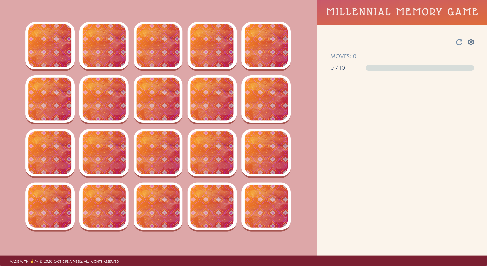
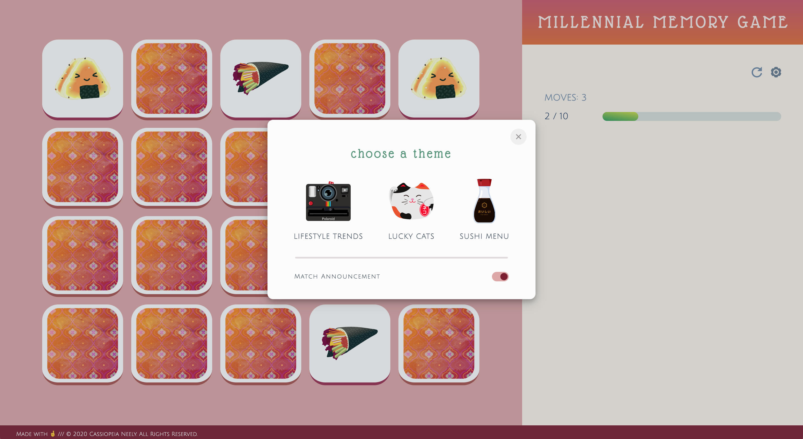
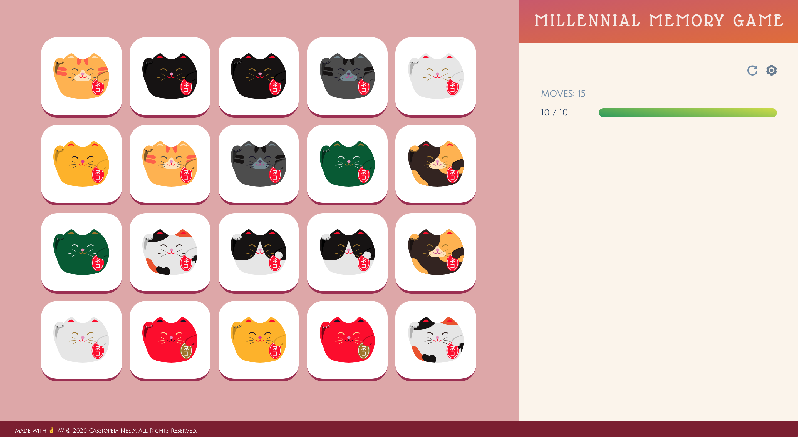
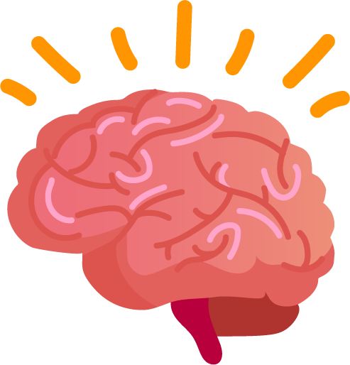

# Memory Game

## Table of Contents

 + [Introduction](#introduction)
 + [Features](#features)
    - [Two Themes](#two-themes)
    - [Progress at a Glance](#progress-at-a-glance)
 + [Favicon](#favicon)
 + [Tech Specs](#tech-specs)

## Introduction

 

 Do you have the recall of an elephant, or are you more of a goldfish? Test your retention skills with [Millennial Memory Game](https://cassiopeian.github.io/memory-game/).

## Features

 ### Two Themes

 

 To choose between the Lifestyle Trends and Lucky Cats game themes, click the cogwheel icon.

 ### Progress at a Glance

 

## Favicon

 

 Here's a better look at the thinking-brain favicon you'll see on your Millennial Memory Game browser tab.

## Tech Specs

 Millennial Memory Game was built with jQuery version 3.4.1.