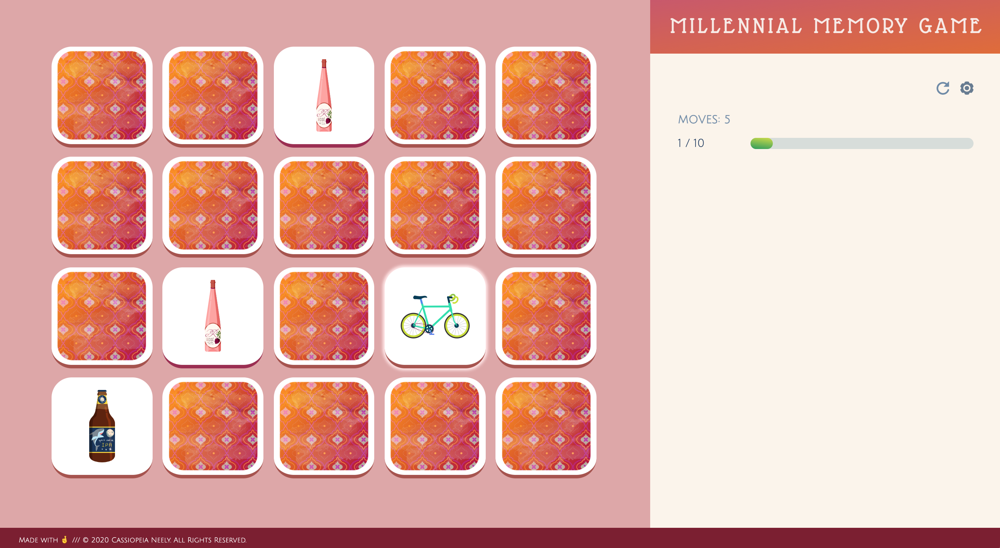
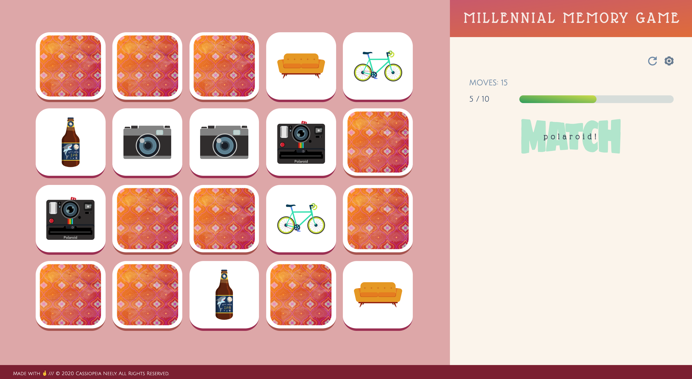

# Memory Game

## Table of Contents

 + [Introduction](#introduction)
 + [Features](#features)
    - [Accessibility](#accessibility)
    - [Three Themes](#three-themes)
    - [Progress at a Glance](#progress-at-a-glance)
    - [Match Alert](#match-alert)
 + [Favicon](#favicon)
 + [Tech Specs](#tech-specs)

## Introduction

 

 Do you have the recall of an elephant, or are you more of a goldfish? Test your retention skills with [Millennial Memory Game](https://cassiopeian.github.io/memory-game/).

## Features

 ### Accessibility

 

 The game tiles glow white when they’re clicked, and your most recently clicked tile will remain glowing even after it returns to its facedown state.

 If you’d prefer to play without a mouse, you can also tab through the game tiles, and use the white glow as a navigation aide.

 The *Reset* and *Settings* icon buttons are also keyboard focusable.

 ### Three Themes

 

 To choose between the Lifestyle Trends, Lucky Cats, and Sushi Menu game themes, click the cogwheel icon.

 ### Progress at a Glance

 

 Watch the green progress bar grow, each time you find a matching pair. To the left of the progress bar, you can also track exactly how many matches you’ve made, out of ten.

 The *Moves* counter will increase by one, each time you select a pair of tiles *or* immediately deselect a single tile.

 ### Match Alert

 

 A green *MATCH* alert will pop up, when you’ve successfully found a pair. In the screenshot, above, the set of polaroid cameras had just been discovered, so the word *polaroid* is superimposed over the word *MATCH*.

 This feature can be disabled by toggling the *Match Announcement* slider in the settings menu.

## Favicon

 

 Here's a better look at the thinking-brain favicon you'll see on your Millennial Memory Game browser tab.

## Tech Specs

 Millennial Memory Game was built with jQuery version 3.4.1.
